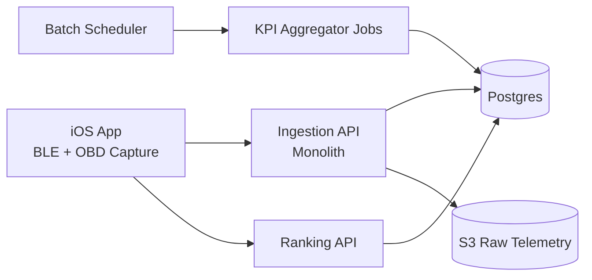

# Car Ranks Architecture (MVP v1)

Status: Draft v3 (EV + Temperature Focus)  
Date: 2026-02-17  
Audience: Product + Engineering

## 1. Purpose
This document defines the MVP system architecture for Car Ranks and explains the key design choices in depth: **what** we are building, **why** each choice is made, and **how** it will work.

## 2. Requirements and Constraints (Confirmed)

## Functional requirements
- MVP is **read-only** (no remote commands).
- Data source for MVP is **OBD-II only** (Smartcar deferred).
- High-value KPIs rely on **EV driving + EV charging telemetry**.
- MVP must expose **temperature vs range** and **temperature vs charging speed** insights, with explicit cold-climate views.
- MVP vehicle focus is **BEV first**; optional **PHEV electric-mode** support when signals are sufficient.
- MVP market focus is EV ecosystem users: **owners, buyers, and sellers**.
- Batch processing cadence must be configurable:
  - max granularity: every **1 minute**
  - minimum: **daily**
- iOS is the only client platform for MVP.

## Scale and budget constraints
- Launch target: ~**1,000 users**.
- Monthly launch budget target: **$700** (infrastructure + core ops tooling).

## Privacy constraints
- Privacy by default.
- Anonymization by default.
- No need for precise GPS in MVP.

## Delivery constraints
- Prefer **monolith** over microservices for MVP simplicity.
- AWS is preferred unless a clear alternative is significantly better.

## Confirmed product decisions
- Reliability target: **best-effort** for MVP.
- Authentication: **Sign in with Apple + email/password**.
- Deployment style: **single EC2** (cost-optimized).
- Identity privacy: **salted VIN hash only** (no raw VIN persistence).
- Default batch interval: **1 minute**.
- KPI scope target: **top 10 KPIs** for v1.
- KPI priority target: **EV range/efficiency + charging performance + temperature impact**, with EV composite score.
- ICE-only and HEV-only ranking tracks are **out of MVP scope**.
- Data retention posture: **retain most raw telemetry in S3** for future KPI and analytics reuse.

## 3. Architecture Decision Summary (What/Why/How)

| Decision | What | Why | How |
|---|---|---|---|
| Backend style | Modular monolith | Lowest complexity and ops overhead for 1k users | Single deployable backend with clear internal modules |
| Data ingestion model | Client-side sampling + server-side batch ingest | Aligns with configurable cadence and keeps network cost predictable | iOS buffers telemetry locally and uploads in intervals |
| Default batch cadence | 1-minute upload window (configurable) | Maximizes driving KPI fidelity for MVP learning | Config service returns defaults; backend enforces safe bounds |
| Data pipeline style | Mostly synchronous ingest + async KPI jobs | Keeps code simple while decoupling expensive computation | API writes raw+normalized data; scheduler triggers KPI aggregation |
| Vehicle coverage (MVP) | BEV primary + optional PHEV electric mode | Keeps product focus sharp while still capturing near-EV vehicles | Gate PHEV inclusion by EV signal completeness thresholds |
| KPI family (MVP) | EV range/efficiency + charging performance + temperature KPIs | Matches target audience and creates differentiated EV insight | Compute EV driving, charging, and temperature-sensitivity KPIs, then materialize EV composite rankings |
| Climate analytics lens | Temperature-binned model comparison (cold focus) | Enables direct cold-climate model benchmarking for owners/buyers/sellers | Derive `temperature_bin` on ingest and compute cold-vs-mild retention metrics |
| Storage | Postgres + S3 | Postgres for queryable KPI/rank data; S3 for cheap raw payload retention | RDS Postgres for core tables, S3 for compressed raw telemetry bundles |
| Telemetry retention model | Retention-first data lake in S3 | Preserves future optionality for new KPIs and ML/analytics use cases | Store most raw telemetry in S3 with partitioning + lifecycle tiering |
| Privacy model | Pseudonymous IDs + no precise location + salted VIN hash only | Meets privacy goals and reduces regulatory risk | Persist only `vin_hash` (salted), avoid precise GPS collection, apply retention rules |
| Cloud/deploy model | AWS single-EC2 deployment | Lowest monthly cost and simplest ops for 1k-user MVP | 1 EC2 app host + RDS + S3 + CloudWatch + EventBridge cron |
| Reliability posture | Best-effort | Matches MVP speed/cost constraints | Single AZ, graceful degradation, alerting, no hard SLA |
| Auth model | Apple + email/password | Balances iOS onboarding ease with account portability | Sign in with Apple token flow + password credentials with secure hashing |
| Client scope | iOS only | Faster execution and lower QA surface | Swift app with BLE/OBD capture, local queue, retry upload |

## 4. System Context

## 5. Component Design

## 5.1 iOS App

### Responsibilities
- Connect to BLE OBD adapter.
- Poll selected OBD signals while driving and during charging sessions.
- Capture ambient/battery temperature signals when available.
- Persist sampled telemetry locally (durable queue).
- Upload telemetry batches on schedule + connectivity availability.
- Request EV KPI/rank views from backend.

### Why this design
- Keeps BLE/adapter volatility isolated to device side.
- Avoids frequent per-sample network calls.
- Supports offline capture and retry, improving data completeness.

### Key implementation notes
- Local storage: SQLite/Core Data ring buffer for telemetry chunks.
- Upload envelopes: compressed JSON payloads by session/window.
- Backoff + retry with idempotent upload token per batch.
- Config endpoint controls sampling and upload intervals.
- MVP default upload cadence: **60 seconds**.

## 5.2 Backend Monolith

### Internal modules
- `auth`: user/session auth and app API keys.
- `ingestion`: validate and store telemetry batches.
- `normalization`: map raw OBD fields to canonical signals.
- `kpi`: compute per-vehicle and per-user EV KPIs.
- `charging`: derive charging sessions and charging performance metrics.
- `climate_analytics`: derive temperature bins and compute temperature-impact KPIs.
- `ranking`: produce ranking snapshots.
- `config`: dynamic sampling/batch config served to app.

### Why monolith
- 1 team / early product phase.
- Faster iteration than distributed services.
- Lower operational and observability overhead under budget.

### How to keep monolith maintainable
- Strict module boundaries.
- Separate schemas/tables by concern.
- Clear contracts between `ingestion -> normalization -> kpi -> ranking`.

## 5.3 Data Stores

### Postgres (primary)
Use for canonical, queryable data:
- users
- vehicles (pseudonymous)
- signal observations (normalized)
- KPI aggregates
- ranking snapshots
- processing metadata

### S3 (raw telemetry archive)
Use for:
- original upload payloads (compressed)
- replay/debug support
- long-horizon retention for future KPI/backtesting use cases
- partitioned historical telemetry data lake (`year/month/day/user_hash` style prefixes)
- lifecycle tiering to cheaper storage classes over time

### Why split storage
- Postgres remains performant and cheaper when it stores normalized/query-critical data.
- S3 is much cheaper for large raw telemetry blobs.

## 5.4 Batch and Compute Model

## Ingestion cadence
- Client captures at configured sampling rate.
- Upload intervals configurable from 1 minute to daily.
- Default MVP upload interval is 1 minute.

## Compute cadence
- Near-periodic KPI updates (e.g., every 1-5 minutes for active users if configured).
- Charging-session finalization jobs after charge-stop detection.
- Daily refresh of model-level temperature baselines (`cold` vs `mild`) for stable retention metrics.
- Daily consolidation job for stable rank snapshots and consistency checks.

## Ranking model
- Keep a materialized `ranking_snapshot` table keyed by timeframe + cohort.
- API reads snapshots, not raw event streams.

### Why this model
- Predictable API latency.
- Simpler than stream processing.
- Fits budget and scale targets.

## 6. Privacy and Data Governance

## Defaults
- Do not store precise GPS coordinates for MVP.
- Use pseudonymous `user_id` and `vehicle_id`.
- Store **salted VIN hash only** in MVP backend stores.

## Data retention strategy
- Retain most raw telemetry in S3 to support future KPI redesigns and secondary analytics.
- Keep normalized/query-serving data in Postgres for current product APIs.
- Apply storage lifecycle policy instead of aggressive deletion:
  - S3 standard (recent hot window), then transition to colder tier(s)
  - optional archival for oldest historical partitions
- Keep PII-minimized posture even with broader retention:
  - salted VIN hash only
  - no precise GPS for MVP

## Security controls
- TLS everywhere.
- At-rest encryption (RDS + S3).
- Least-privilege IAM.
- Audit logging for admin/data-access operations.

## 7. AWS Deployment (MVP)

## Recommended baseline
- Compute: **single EC2** host for monolith app runtime.
- Database: RDS Postgres (small instance class, single AZ for MVP).
- Object storage: S3.
- Scheduling: EventBridge cron -> job runner endpoint.
- Observability: CloudWatch logs/metrics/alarms.
- Optional queue: SQS only if ingestion spikes require decoupling.

## Why AWS for this MVP
- Managed services reduce ops burden.
- Good cost/perf at 1k users.
- Clear path to scale later without redesign.

## Alternative options and tradeoffs
- Supabase: faster initial setup and lower ops effort, but less control over custom pipeline behavior and fine-grained AWS-native scaling path.
- Firebase: strong mobile tooling, weaker fit for SQL-heavy KPI/ranking analytics compared with Postgres-centric design.

Conclusion: AWS remains a strong default for your constraints.

## 8. Budget Fit (Launch Estimate)

Rough monthly estimate (MVP, single-EC2 baseline, retention-first telemetry in S3):
- Compute (EC2): $30-$120
- RDS Postgres: $80-$180
- S3 + transfer: $30-$140
- Logs/monitoring: $20-$90
- Misc (backups, secrets, variability buffer): $40-$130

Expected range: **$200-$660/month** depending on telemetry volume, retention growth, and logging settings.

To stay reliably under $700:
- Keep logs sampled/structured (avoid verbose debug in prod).
- Keep Postgres lean; push historical raw telemetry to S3 tiers.
- Enable S3 lifecycle transitions early (do not wait for bucket growth).
- Avoid always-on nonessential workers.

## 9. API Surface (MVP)

## Client-facing APIs
- `POST /v1/telemetry/batches`
- `GET /v1/config/sampling`
- `GET /v1/kpis/me`
- `GET /v1/kpis/charging`
- `GET /v1/kpis/temperature-impact`
- `GET /v1/rankings` (supports `temperature_bin` filter)

## Admin/internal APIs
- `POST /internal/jobs/recompute-kpis`
- `POST /internal/jobs/build-ranking-snapshots`

## 10. Failure Modes and Mitigations

| Failure mode | Impact | Mitigation |
|---|---|---|
| BLE disconnect during drive | Missing telemetry segments | local buffering, reconnect logic, session gap markers |
| Upload failures | Delayed KPI updates | retry with backoff + idempotency key |
| KPI job delay | stale rankings | job health metrics + alarm + fallback to last good snapshot |
| Missing battery temperature on charging | lower charging KPI confidence | temp-adjusted fallback logic + explicit confidence labeling |
| Sparse cold-weather samples | misleading cold-climate comparisons | minimum sample gates + low-confidence badge + fallback to broader cohort |
| DB hotspot on raw writes | ingest slowdown | move raw payloads to S3; keep DB normalized writes lean |
| Budget overrun from logs/storage | cost breach | S3 lifecycle tiering, partition hygiene, logging level controls |

## 11. Evolution Path (Post-MVP)

Phase 2 candidates:
- Add Smartcar as secondary source adapter.
- Add ICE/HEV ranking tracks if EV-first KPI model is stable.
- Introduce source merge policy in canonical layer.
- Add queue-based decoupling (SQS) if ingestion throughput grows.
- Add Android client with same backend contracts.

Phase 3 candidates:
- Split monolith if needed by measurable bottlenecks (not preemptively).
- Consider read replicas/materialized view strategy for ranking at larger scale.

## 12. Open Questions (Need Your Input)
1. Final temperature-bin definitions and cold-climate thresholds for comparisons.
2. Resolved on **2026-02-20**: EV-first KPI formulas and required signal mapping are locked in backend KPI catalog and contract docs.
3. Ambient-temperature fallback policy when OBD temperature signals are missing.
4. Priority order for remaining tradeoffs (speed-to-market vs cost vs KPI accuracy vs maintainability).

## 13. Immediate Next Steps
1. Lock temperature-bin derivation logic and minimum sample gates for cold-climate insights.
2. Lock ingestion payload schema and idempotency strategy for 1-minute cadence.
3. Implement the Postgres schema + signal registry from `research/schema/`.
4. Build thin end-to-end slice on single EC2: iOS capture -> batch upload -> KPI calc -> ranking API.
